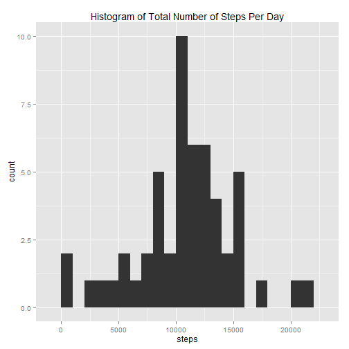
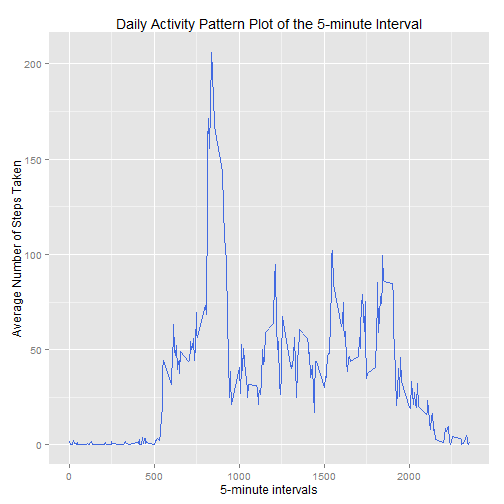
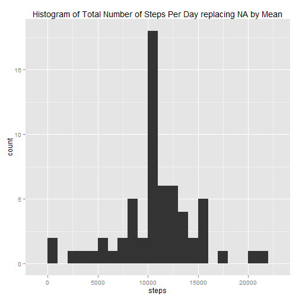

## Loading the required libraries


```r
library(ggplot2)
```

## Loading and preprocessing the data
As Activity.csv is forked as it is in repository, Just unzip the same and read with complete cases. Head gives brief idea about data and dim gives the dimension of data.


```r
unzip("activity.zip")
data <- read.csv("activity.csv", colClasses = c("integer", "Date", "factor"))
data$month <- as.numeric(format(data$date, "%m"))
good <- complete.cases(data)
filtered_Data <- data[good,]
head(filtered_Data)
```

```
##     steps       date interval month
## 289     0 2012-10-02        0    10
## 290     0 2012-10-02        5    10
## 291     0 2012-10-02       10    10
## 292     0 2012-10-02       15    10
## 293     0 2012-10-02       20    10
## 294     0 2012-10-02       25    10
```

```r
dim(filtered_Data)
```

```
## [1] 15264     4
```


## What is mean total number of steps taken per day?
For this part of the assignment, you can ignore the missing values in the dataset.

1. Calculate the total number of steps taken per day Re


```r
stepsByDay <- aggregate(steps ~ date, filtered_Data, sum)
ggplot(stepsByDay) + aes(x=steps) + geom_histogram(binwidth=1000) + labs(title="Histogram of Total Number of Steps Per Day")
```

 

```r
meanResult <- mean(stepsByDay$steps)
medianResult <- median(stepsByDay$steps)
```

3. Calculate and report the mean and median of the total number of steps taken per day

The mean total number of steps per day is  ``10766.19`` , and the median total number of steps per day is  ``10765`` .
 

## What is the average daily activity pattern?

1. Make a time series plot (i.e. type = "l") of the 5-minute interval (x-axis) and the average number of steps taken, averaged across all days (y-axis)


```r
DailyAvgSteps <- aggregate(filtered_Data$steps, list(interval = as.numeric(as.character(filtered_Data$interval))), FUN = "mean")
names(DailyAvgSteps)[2] <- "StepsMean"

ggplot(DailyAvgSteps, aes(interval, StepsMean)) + geom_line(color = "royalblue", size = 0.5) + labs(title = "Daily Activity Pattern Plot of the 5-minute Interval", x = "5-minute intervals", y = "Average Number of Steps Taken")
```

 

2. Which 5-minute interval, on average across all the days in the dataset, contains the maximum number of steps?


```r
maxInterval <- DailyAvgSteps[DailyAvgSteps$StepsMean == max(DailyAvgSteps$StepsMean), ]
```

The 5-minute interval that contains the maximum number of steps is  ``835, 206.1698113`` 

## Imputing missing values

1. Calculate and report the total number of missing values in the dataset (i.e. the total number of rows with NAs)


```r
colMeans(is.na(data))  ## tocheck which column contains NA
```

```
##     steps      date  interval     month 
## 0.1311475 0.0000000 0.0000000 0.0000000
```

```r
sum(is.na(data))       ## Give the no of rows contains NA 
```

```
## [1] 2304
```

2.Devise a strategy for filling in all of the missing values in the dataset. The strategy does not need to be sophisticated. For example, you could use the mean/median for that day, or the mean for that 5-minute interval, etc.

For this I am going to use the mean for that 5-minute interval to fill each NA value in the steps column.

3. Create a new dataset that is equal to the original dataset but with the missing data filled in.


```r
imputtedData <- data 
for (i in 1:nrow(imputtedData)) {
    if (is.na(imputtedData$steps[i])) {
        imputtedData$steps[i] <- ceiling(DailyAvgSteps[which(imputtedData$interval[i] == DailyAvgSteps$interval), ]$StepsMean)
    }
}

head(imputtedData)
```

```
##   steps       date interval month
## 1     2 2012-10-01        0    10
## 2     1 2012-10-01        5    10
## 3     1 2012-10-01       10    10
## 4     1 2012-10-01       15    10
## 5     1 2012-10-01       20    10
## 6     3 2012-10-01       25    10
```

```r
sum(is.na(imputtedData)) ## to check whether any data contain NA
```

```
## [1] 0
```

4.1 Make a histogram of the total number of steps taken each day and Calculate and report the mean and median total number of steps taken per day.


```r
stepsByDayImputted <- aggregate(steps ~ date, imputtedData, sum)
ggplot(stepsByDayImputted) + aes(x=steps) + geom_histogram(binwidth=1000) + labs(title="Histogram of Total Number of Steps Per Day replacing NA by Mean")
```

 

```r
meanResultImputted <- mean(stepsByDayImputted$steps)
medianResultImputted <- median(stepsByDayImputted$steps)
```

The mean total number of steps per day is  ``10784.92`` , and the median total number of steps per day is  ``10909`` .

4.2 Do these values differ from the estimates from the first part of the assignment? 


```r
meanResultImputted - meanResult
```

```
## [1] 18.72935
```

```r
medianResultImputted - medianResult
```

```
## [1] 144
```

```r
totalDiff <- sum(stepsByDayImputted$steps) - sum(stepsByDay$steps)
totalDiff
```

```
## [1] 87272
```

4.3 What is the impact of imputing missing data on the estimates of the total daily number of steps?

As there is a difference in totanl no of steps, in that case there is also a difference in mean and median.We can findout the on-average of all day by this. hence make a difference from previous plot.


## Are there differences in activity patterns between weekdays and weekends?

1. Create a new factor variable in the dataset with two levels - "weekday" and "weekend" indicating whether a given date is a weekday or weekend day.


```r
head(imputtedData)
```

```
##   steps       date interval month
## 1     2 2012-10-01        0    10
## 2     1 2012-10-01        5    10
## 3     1 2012-10-01       10    10
## 4     1 2012-10-01       15    10
## 5     1 2012-10-01       20    10
## 6     3 2012-10-01       25    10
```

```r
imputtedData$weekdays <- factor(format(imputtedData$date, "%A"))
levels(imputtedData$weekdays)
```

```
## [1] "Friday"    "Monday"    "Saturday"  "Sunday"    "Thursday"  "Tuesday"  
## [7] "Wednesday"
```

```r
levels(imputtedData$weekdays) <- list(weekday = c("Monday", "Tuesday",
                                             "Wednesday", 
                                             "Thursday", "Friday"),
                                 weekend = c("Saturday", "Sunday"))
levels(imputtedData$weekdays)
```

```
## [1] "weekday" "weekend"
```

```r
table(imputtedData$weekdays)
```

```
## 
## weekday weekend 
##   12960    4608
```

2. Make a panel plot containing a time series plot (i.e. type = "l") of the 5-minute interval (x-axis) and the average number of steps taken, averaged across all weekday days or weekend days (y-axis)


```r
avgSteps <- aggregate(imputtedData$steps, 
                      list(interval = as.numeric(as.character(imputtedData$interval)), 
                           weekdays = imputtedData$weekdays),
                      FUN = "mean")
names(avgSteps)[3] <- "meanOfSteps"
library(lattice)
xyplot(avgSteps$meanOfSteps ~ avgSteps$interval | avgSteps$weekdays, 
       layout = c(1, 2), type = "l", 
       xlab = "Interval", ylab = "Number of steps")
```

 
